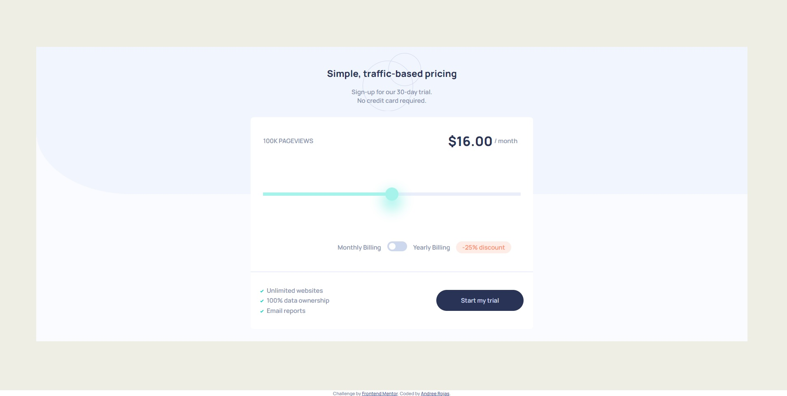

# Frontend Mentor - Interactive pricing component solution

This is a solution to the [Interactive pricing component challenge on Frontend Mentor](https://www.frontendmentor.io/challenges/interactive-pricing-component-t0m8PIyY8). Frontend Mentor challenges help you improve your coding skills by building realistic projects. 

## Table of contents

- [Overview](#overview)
  - [Screenshot](#screenshot)
  - [Links](#links)
- [My process](#my-process)
  - [Built with](#built-with)
- [Author](#author)

## Overview

### Screenshot

Desktop version

Mobile version

### Links

- [Solution URL](https://github.com/andreerojas/andreerojas-FrontEndMentor_Challenge_12.git)
- [Live Site URL](https://andreerojas.github.io/andreerojas-FrontEndMentor_Challenge_12/)

## My process
### Built with

- Semantic HTML5 markup
- CSS custom properties
- Flexbox
- CSS grid
- Javascript

## Author

- Website - [Andree Rojas]